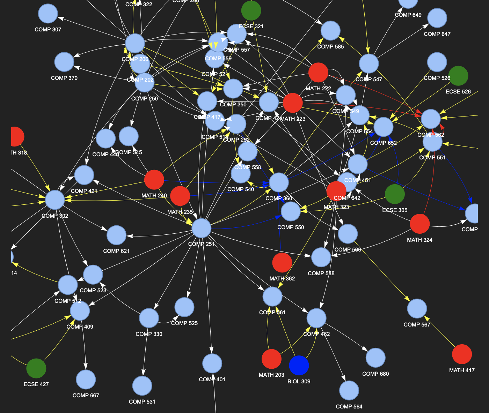

# Prerequisite Graph for McGill Computer Science Courses

This is a simple utility that uses pyvis to visualize the prerequisites of McGill CS courses as a directed graph. This app is available at <a href="https://huggingface.co/spaces/rishinair05/mcgill-computer-science-prerequisite-visualization"> https://huggingface.co/spaces/rishinair05/mcgill-computer-science-prerequisite-visualization</a>

A white line denotes an essential prerequisite. e.g., a white line connects COMP 250 to COMP 302, meaning that COMP 250 is an essential prerequisite for COMP 302.

"When blue and/or yellow lines are connected to a node, only one prerequisite from each line colour is required. e.g., MATH 240, MATH 235, MATH 318, COMP 230, PHIL 210 are connected to COMP 302 by a yellow line, meaning only one of these courses have to be completed.

All prerequisites connected to a node with red lines must either all be completed or a yellow line prerequisite be completed. e.g., COMP 551, MATH 222, MATH 223, and MATH 324 are connected to COMP 562 via red lines whereas MATH 462, COMP 451, and ECSE 551 are connected to COMP 562 via yellow lines. This means either all of COMP551 + MATH 222 + MATH 223 + MATH 324, or one of MATH 462/COMP 451/ECSE 551 must be completed.

If you encounter any errors/issues or you have any suggestions, please email rishi.nair(AT)mail.mcgill.ca or file an issue on the github repository at https://github.com/rishinair05/mcgill-cs-prereq. If you have found this tool useful, feel free to star the github repository.
